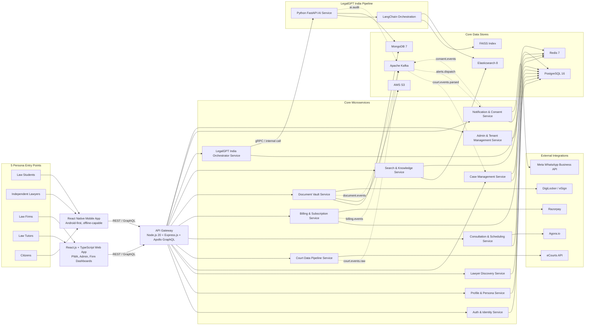

# 📁 [DELIVERABLE 1: HIGH-LEVEL ARCHITECTURE]

## Scope

This diagram implements the approved Legal Sathi high-level architecture for MacBook-first development while preserving the production target of AWS `ap-south-1`, Kubernetes/EKS, and microservice boundaries.

- Solid arrows: synchronous REST/GraphQL or direct service calls
- Dotted arrows: asynchronous Kafka streams and event-driven propagation

## Architecture Notes

- `LegalGPT India Orchestrator Service` is the only Node-side entry point into the AI pipeline.
- `Document Vault Service` stores metadata and version history in MongoDB and document/media binaries in AWS S3.
- `Search & Knowledge Service` owns judgment retrieval, faceting, and cross-language search against Elasticsearch.
- `Court Data Pipeline Service` is the only service allowed to ingest directly from eCourts and emit court event streams.

## Assumptions

- `[ASSUMPTION]` Local development uses Docker Compose with single-node data services; production remains multi-AZ on AWS `ap-south-1`.
- `[ASSUMPTION]` Local FAISS indexes and Elasticsearch corpora are reduced datasets for faster iteration on the MacBook.
- `[ASSUMPTION]` AWS S3 access can remain adapter-driven in local development until credentials are configured, without changing the production storage boundary.

