# 📁 [DELIVERABLE 2: LOW-LEVEL ARCHITECTURE]

## Service Communication Standard

- REST: domain CRUD, auth, admin, scheduling, billing, document workflows
- GraphQL: dashboard aggregation, judgment search, AI sessions, firm workspace views
- gRPC: `LegalGPT India Orchestrator Service` to Python FastAPI AI service only
- Kafka: all event streams and audit propagation

```mermaid
graph TD
  User["React Native / React Web Clients"] --> WAF["AWS WAF"]
  WAF --> Ingress["Ingress / Load Balancer"]
  Ingress --> APIGW["API Gateway<br/>REST + GraphQL"]
  APIGW --> RateLimiter["Redis Rate Limiter"]
  APIGW --> CircuitBreaker["Circuit Breaker Policies"]

  subgraph DomainServices["Domain Services"]
    Auth["Auth & Identity Service"]
    Profile["Profile & Persona Service"]
    LawyerDiscovery["Lawyer Discovery Service"]
    CaseMgmt["Case Management Service"]
    CourtData["Court Data Pipeline Service"]
    Consult["Consultation & Scheduling Service"]
    Billing["Billing & Subscription Service"]
    Documents["Document Vault Service"]
    Search["Search & Knowledge Service"]
    AIOrchestrator["LegalGPT India Orchestrator Service"]
    Notify["Notification & Consent Service"]
    Admin["Admin & Tenant Management Service"]
  end

  APIGW -->|REST| Auth
  APIGW -->|REST| Profile
  APIGW -->|REST| LawyerDiscovery
  APIGW -->|REST| CaseMgmt
  APIGW -->|REST| CourtData
  APIGW -->|REST| Consult
  APIGW -->|REST| Billing
  APIGW -->|REST| Documents
  APIGW -->|GraphQL| Search
  APIGW -->|REST / GraphQL| AIOrchestrator
  APIGW -->|REST| Notify
  APIGW -->|REST| Admin

  subgraph DataPlane["Data Plane"]
    PGWrite["PostgreSQL 16<br/>Transactional Write Models"]
    PGRead["PostgreSQL 16<br/>Logical Read Models"]
    MongoWrite["MongoDB 7<br/>Document Metadata + Version History"]
    MongoRead["MongoDB 7<br/>Document Read Views"]
    Elastic["Elasticsearch 8<br/>Judgment Search Index"]
    Redis["Redis 7<br/>Cache + Rate Limits + Sync Cursors"]
    Kafka["Apache Kafka"]
    S3["AWS S3<br/>Document / Media Binaries"]
    Audit["Immutable Audit Logger<br/>7-year retention"]
  end

  Auth --> PGWrite
  Auth --> PGRead
  Profile --> PGWrite
  Profile --> PGRead
  LawyerDiscovery --> PGRead
  CaseMgmt --> PGWrite
  CaseMgmt --> PGRead
  Consult --> PGWrite
  Consult --> PGRead
  Billing --> PGWrite
  Billing --> PGRead
  Admin --> PGWrite
  Admin --> PGRead
  Documents --> MongoWrite
  Documents --> MongoRead
  Documents --> S3
  Search --> Elastic
  Search --> Redis
  Notify --> Redis
  APIGW --> Redis
  AIOrchestrator --> Redis

  PGWrite -. "logical read projection" .-> PGRead
  MongoWrite -. "logical read projection" .-> MongoRead

  subgraph AIPipeline["LegalGPT India RAG Pipeline"]
    QueryIngress["AI Query Request"]
    ConsentCheck["DPDP Consent Check"]
    PIIGuard["PII Guard"]
    Retrieval["FAISS Retrieval"]
    SearchAugment["Elasticsearch Legal Search Augmentation"]
    Compose["LegalGPT India Response Composer"]
    Verify["Citation Verification"]
    Confidence["Confidence Scoring + Threshold Gate"]
    Response["Citation-bound Response"]
  end

  AIOrchestrator -->|gRPC| QueryIngress
  QueryIngress --> ConsentCheck
  ConsentCheck --> PIIGuard
  PIIGuard --> Retrieval
  PIIGuard --> SearchAugment
  Retrieval --> Compose
  SearchAugment --> Compose
  Compose --> Verify
  Verify --> Confidence
  Confidence --> Response
  Retrieval --> FAISS["FAISS Index"]
  SearchAugment --> Elastic
  Verify --> MongoRead
  Confidence -. "ai.audit" .-> Kafka

  subgraph CourtPipeline["Court Data Pipeline"]
    eCourts["eCourts API"]
    Scrapers["Fallback Scrapers"]
    Ingest["Court Ingestion Adapters"]
    RawTopic["Topic: court.events.raw"]
    Parser["Cause List Parser"]
    ParsedTopic["Topic: court.events.parsed"]
    Dispatcher["Alert Dispatcher"]
    AlertsTopic["Topic: alerts.dispatch"]
  end

  eCourts --> Ingest
  Scrapers --> Ingest
  Ingest -.-> RawTopic
  RawTopic -.-> Kafka
  Kafka -.-> Parser
  Parser -.-> ParsedTopic
  ParsedTopic -.-> Kafka
  Kafka -.-> CaseMgmt
  Kafka -.-> Dispatcher
  Dispatcher -.-> AlertsTopic
  AlertsTopic -.-> Kafka
  Kafka -.-> Notify

  subgraph NotificationStack["Notification Stack"]
    PreferenceEngine["Consent + Preference Engine"]
    PushAdapter["Push Adapter"]
    WhatsAppAdapter["Meta WhatsApp Business Adapter"]
    SMSAdapter["SMS Adapter"]
    InAppFeed["In-app Notification Feed"]
  end

  Notify --> PreferenceEngine
  PreferenceEngine --> PushAdapter
  PreferenceEngine --> WhatsAppAdapter
  PreferenceEngine --> SMSAdapter
  PreferenceEngine --> InAppFeed

  subgraph Security["Security and Compliance"]
    IAM["IAM Least-Privilege Policies"]
    KMS["AWS KMS Key Management"]
    ConsentManager["DPDP Consent Manager"]
  end

  IAM --> APIGW
  IAM --> Auth
  IAM --> CaseMgmt
  IAM --> Documents
  IAM --> AIOrchestrator
  IAM --> Notify
  IAM --> Admin
  KMS --> PGWrite
  KMS --> MongoWrite
  KMS --> S3
  ConsentManager --> Notify
  ConsentManager --> AIOrchestrator

  Auth --> Audit
  CaseMgmt --> Audit
  Billing --> Audit
  Documents --> Audit
  AIOrchestrator --> Audit
  Notify --> Audit
  Admin --> Audit

  Billing --> Razorpay["Razorpay"]
  Consult --> Agora["Agora.io"]
  Documents --> DigiLocker["DigiLocker / eSign"]
```

## Operational Notes

- `RateLimiter` and `CircuitBreaker` sit at the API boundary to protect both internal services and external integrations.
- Read/write separation is logical inside PostgreSQL and MongoDB; no unapproved read-replica technology is introduced.
- `SMS Adapter` is intentionally abstracted because no SMS vendor has been approved yet.
- `Immutable Audit Logger` receives events from auth, data access, AI, billing, and admin operations.

## Assumptions

- `[ASSUMPTION]` External integration timeouts default to idempotent retry with exponential backoff and audit logging.
- `[ASSUMPTION]` Local development disables Elasticsearch security only inside Docker Compose; production remains encrypted and policy-controlled.
