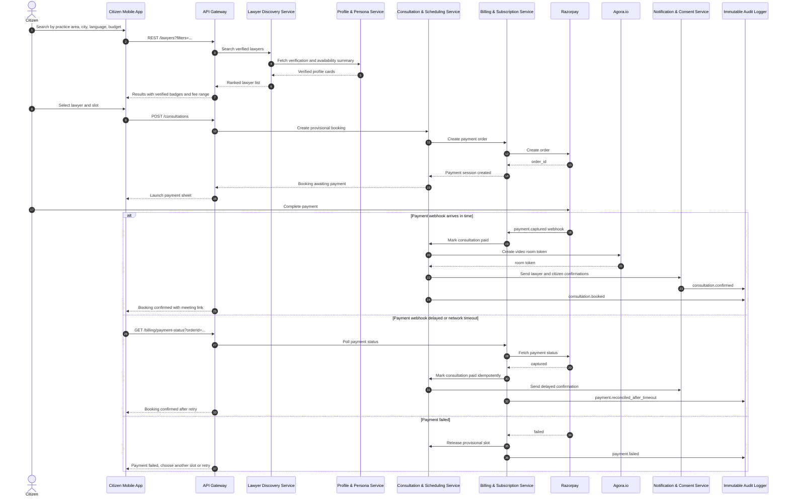
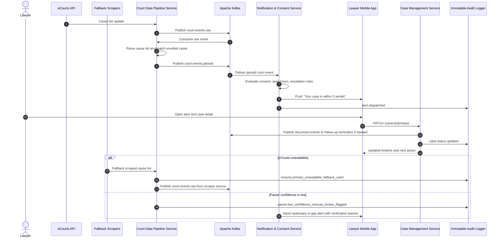
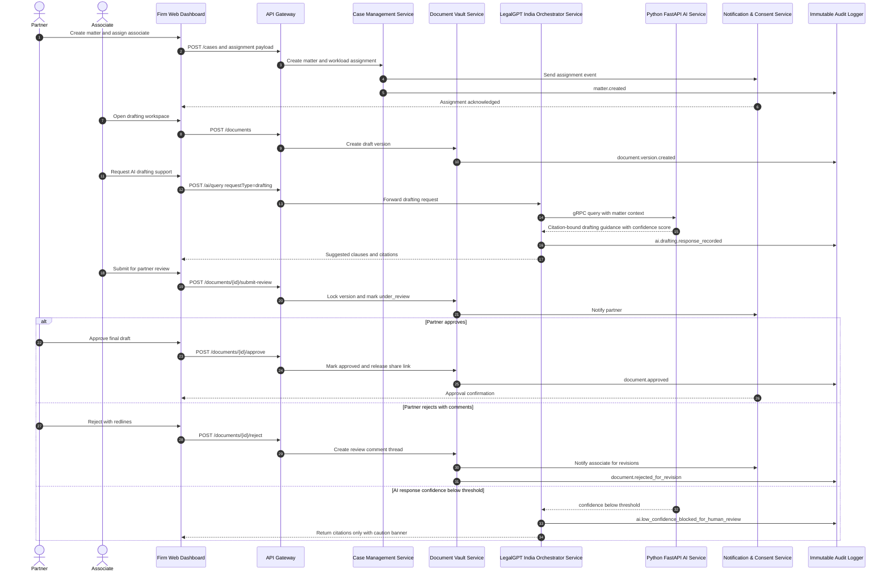
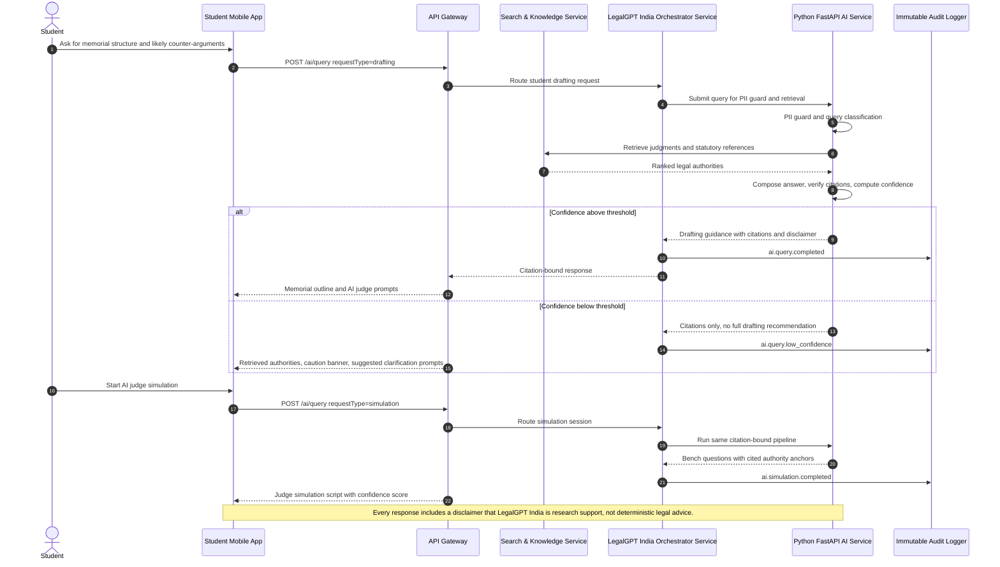
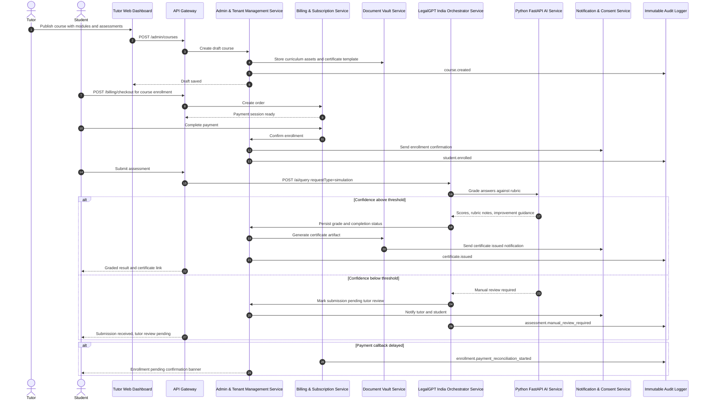

# 📁 [DELIVERABLE 3: DETAILED FLOW DESIGN]

## 1. Citizen Books a Verified Lawyer Consultation

## 2. Independent Lawyer Receives a Real-Time Court Alert and Updates Case Status

## 3. Firm Partner Assigns a Matter, Team Drafts, and Partner Approves

## 4. Law Student Uses LegalGPT India for Moot Memorial Drafting and Judge Simulation

## 5. Law Tutor Publishes a Course, Student Enrolls, AI Grading Runs, and Certificate Is Issued

## Flow Design Guarantees

- Every critical path records immutable audit events.
- Every AI path includes PII guard, retrieval, citation verification, confidence scoring, and explicit disclaimer behavior.
- Every external integration path uses idempotency and retry-safe reconciliation.
