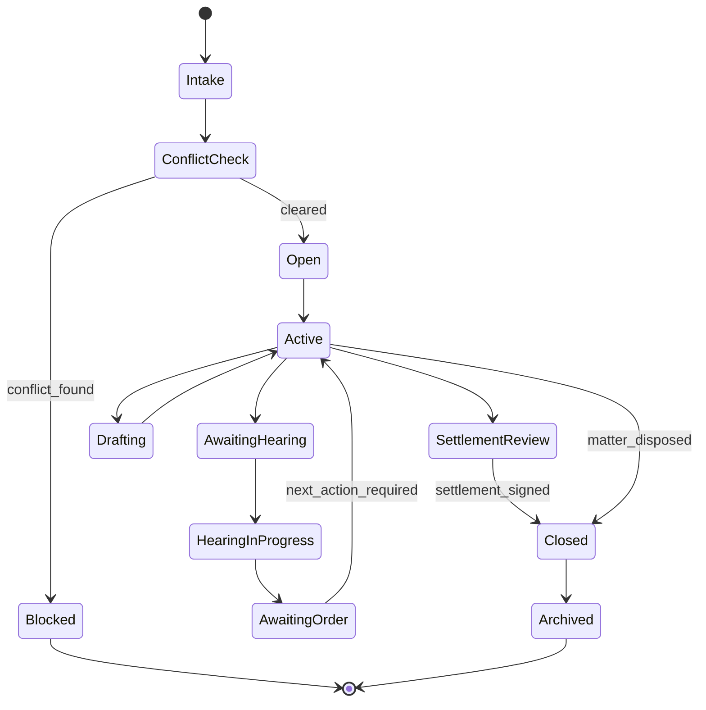
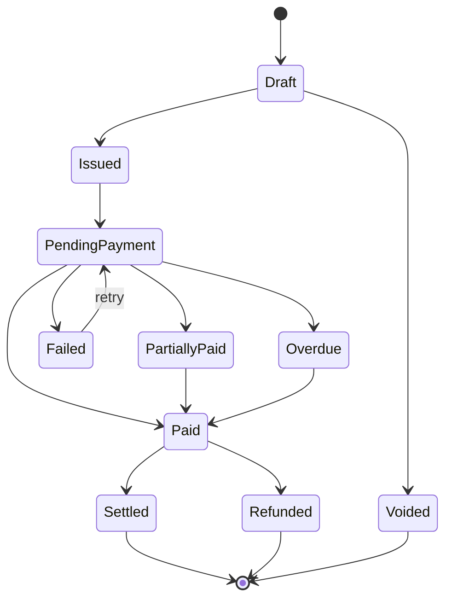
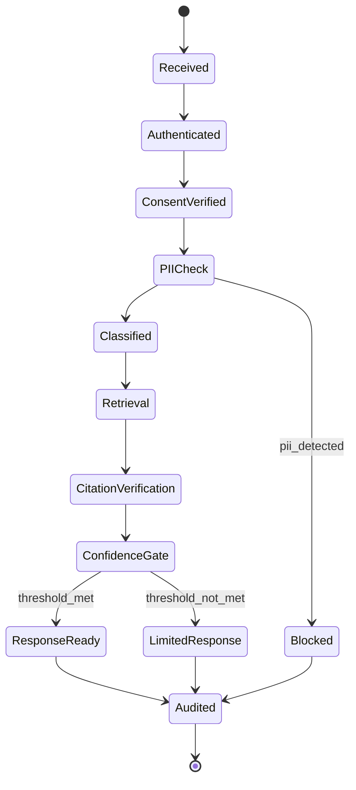

# 📁 [DELIVERABLE 4: ENHANCED PRODUCT & BUSINESS REQUIREMENT DOCUMENT]

## Summary

This PRD/BRD converts the source Legal Sathi document into a developer-ready specification aligned to the approved stack, the MacBook-first local development model, and the required production target in AWS `ap-south-1`.

## Platform Contract

- Personas: Law Students, Independent Lawyers, Law Firms, Law Tutors, Citizens
- Canonical services: `Auth & Identity`, `Profile & Persona`, `Lawyer Discovery`, `Case Management`, `Court Data Pipeline`, `Consultation & Scheduling`, `Billing & Subscription`, `Document Vault`, `Search & Knowledge`, `LegalGPT India Orchestrator`, `Notification & Consent`, `Admin & Tenant Management`
- Public REST families: `/auth`, `/profiles`, `/lawyers`, `/cases`, `/consultations`, `/billing`, `/documents`, `/alerts`, `/consents`, `/admin`
- Public GraphQL families: dashboard aggregation, judgment search, AI assistant sessions, firm workspace views
- Kafka topics: `court.events.raw`, `court.events.parsed`, `alerts.dispatch`, `billing.events`, `document.events`, `ai.audit`, `consent.events`

## Persona Feature Matrix

| Persona | Primary Screens | Core Value | MVP Features | Paid/Revenue Model | Primary Acceptance Gate |
|---|---|---|---|---|---|
| Law Students | `S-01`, `S-02`, `S-07`, `S-08`, `S-09`, `S-10`, `S-17`, `S-18` | Affordable legal research and moot preparation | Judgment search, case digests, LegalGPT India, moot suite, internship hub | Free, Pro `₹299/month`, Pro Annual `₹2,499/year` | Search returns cited authorities and saved progress syncs offline |
| Independent Lawyers | `S-04`, `S-05`, `S-06`, `S-07`, `S-12`, `S-13`, `S-14`, `S-16`, `S-17` | Practice management, alerts, drafting, billing | Case management, court alerts, client communications, consultation booking, billing | Free, Solo `₹799/month`, Solo Pro `₹1,499/month`, 15% consultation commission | Court alerts arrive under latency target and case updates are audit logged |
| Law Firms | `S-04`, `S-05`, `S-06`, `A-04`, `A-05`, `A-06`, `A-08`, `A-13` | Team collaboration and approval workflows | Matter assignment, collaborative drafting, partner approvals, utilization analytics, compliance logs | Team `₹2,499/month`, Firm `₹7,999/month`, Enterprise custom | Role-based access, approval workflow, and audit evidence must remain immutable |
| Law Tutors | `S-07`, `A-11`, course authoring surfaces, grading workflow | Legal education publishing and monetization | Course publishing, student enrollment, AI grading assist, certificate issuance | Free, Educator `₹999/month`, Educator Annual `₹8,499/year`, Institute `₹4,999/month`, 30% marketplace fee | Course moderation and grading confidence routing must work before certificate issuance |
| Citizens | `S-07`, `S-11`, `S-12`, `S-15`, `S-17`, `S-18` | Lawyer discovery and trusted access to consultations | Lawyer search, verified profiles, booking, document storage, rights explainer | Free, Premium `₹99/month`, 15% consultation commission | Verified lawyer badges, payment reconciliation, and booking confirmations must be consistent |

## Persona Acceptance Criteria

### Law Students

```gherkin
Scenario: Student retrieves citation-bound research results
  Given a logged-in student with an active session
  When the student searches a legal issue in Judgment Search
  Then the system returns ranked results with court, date, act, and citation metadata
  And the student can save the result to the library for offline access

Scenario: Student uses LegalGPT India for moot drafting
  Given a student submits a moot drafting query
  When the AI pipeline completes with confidence above threshold
  Then the answer includes verified citations, a confidence score, and a legal-assistance disclaimer
```

### Independent Lawyers

```gherkin
Scenario: Lawyer receives a live cause-list alert
  Given a lawyer has enabled court alerts for an enrolled case
  When the Court Data Pipeline matches a cause-list event to that case
  Then the Notification & Consent Service dispatches a push alert within the configured latency window
  And the alert delivery is written to the immutable audit log

Scenario: Lawyer updates a matter after hearing
  Given a lawyer is viewing a case detail screen
  When the lawyer updates the case status and hearing notes
  Then the Case Management Service persists the update in PostgreSQL
  And publishes any follow-up reminders through Kafka if required
```

### Law Firms

```gherkin
Scenario: Partner assigns a new matter to an associate
  Given a firm partner creates a new matter
  When the partner assigns the matter to an associate
  Then the assignment appears in the associate workspace
  And both assignment and access grant are audit logged

Scenario: Partner approves a collaborative draft
  Given a document is in under_review state
  When the partner approves the final version
  Then the Document Vault marks it approved and locks the approved version hash
  And the approval event becomes exportable from the compliance log
```

### Law Tutors

```gherkin
Scenario: Tutor publishes a moderated course
  Given a tutor completes course metadata and uploads learning assets
  When the admin moderation check passes
  Then the course becomes visible to eligible students in the marketplace
  And pricing, revenue split, and consent terms are stored with the course record

Scenario: AI grading falls below confidence threshold
  Given a student submits an assessment
  When the AI grading pipeline returns confidence below threshold
  Then the submission is routed to manual tutor review
  And no certificate is issued until tutor approval is recorded
```

### Citizens

```gherkin
Scenario: Citizen books a verified lawyer consultation
  Given a citizen selects a verified lawyer profile and an open slot
  When payment is captured successfully
  Then the consultation is confirmed with meeting details and confirmation notifications
  And the system stores commission and settlement records separately

Scenario: Citizen requests account deletion
  Given a citizen completes identity verification for deletion
  When the deletion workflow is approved
  Then personal data is queued for deletion within 72 hours unless under lawful retention
  And the request lifecycle remains visible in the DPDP rights portal
```

## API Contract Outlines

### REST Endpoints

| Method | Path | Service | Request Keys | Response Keys |
|---|---|---|---|---|
| `POST` | `/auth/sessions` | Auth & Identity | `identifier`, `otp`, `password`, `device` | `accessToken`, `refreshToken`, `persona`, `consentVersion` |
| `POST` | `/profiles` | Profile & Persona | `persona`, `name`, `languages`, `practiceAreas`, `collegeOrFirm` | `profileId`, `completionState`, `verificationState` |
| `GET` | `/lawyers` | Lawyer Discovery | `city`, `practiceArea`, `language`, `budgetRange`, `availability`, `verifiedOnly` | `items[]`, `pagination`, `facets`, `appliedFilters` |
| `POST` | `/cases` | Case Management | `title`, `courtId`, `clientId`, `assignedUsers`, `filingType` | `caseId`, `status`, `timeline[]` |
| `PATCH` | `/cases/{caseId}/status` | Case Management | `status`, `notes`, `nextHearingAt`, `alertPreferences` | `caseId`, `status`, `updatedAt`, `auditRef` |
| `GET` | `/alerts` | Notification & Consent | `cursor`, `type`, `priority`, `readState` | `items[]`, `nextCursor` |
| `POST` | `/consultations` | Consultation & Scheduling | `lawyerId`, `slotStart`, `durationMinutes`, `mode`, `preConsultationForm` | `consultationId`, `paymentOrderId`, `bookingState` |
| `POST` | `/billing/orders` | Billing & Subscription | `entityType`, `entityId`, `amount`, `currency`, `taxContext` | `orderId`, `gatewayReference`, `payableAmount` |
| `POST` | `/documents` | Document Vault | `caseId`, `documentType`, `fileName`, `storageClass`, `tags` | `documentId`, `versionId`, `uploadPolicy` |
| `POST` | `/documents/{documentId}/versions` | Document Vault | `parentVersionId`, `changeSummary`, `checksum` | `versionId`, `status`, `signedUrl` |
| `POST` | `/ai/query` | LegalGPT India Orchestrator | `sessionId`, `persona`, `language`, `query`, `requestType` | `answer`, `citations[]`, `confidence`, `disclaimer`, `traceId` |
| `POST` | `/consents` | Notification & Consent | `purpose`, `channel`, `status`, `capturedAt`, `locale` | `consentId`, `effectiveVersion`, `auditRef` |
| `GET` | `/admin/tenants/{tenantId}/metrics` | Admin & Tenant Management | `window`, `persona`, `plan`, `region` | `mau`, `retention`, `revenue`, `alertLatency`, `aiSatisfaction` |

### GraphQL Operations

| Operation | Purpose | Primary Service Composition |
|---|---|---|
| `dashboardSummary(persona, dateRange)` | Morning brief, counters, tasks, alerts | Profile, Case Management, Notification, Billing |
| `judgmentSearch(query, filters, page)` | Faceted case-law search | Search & Knowledge, Elasticsearch |
| `aiAssistantSession(sessionId)` | AI thread history and citations | LegalGPT India Orchestrator, Document Vault |
| `firmWorkspace(matterId)` | Matter dashboard, assignments, document states, approvals | Case Management, Document Vault, Admin & Tenant |

### Canonical Schema Shapes

```typescript
export interface LawyerSearchResult {
  lawyerId: string;
  displayName: string;
  city: string;
  languages: string[];
  practiceAreas: string[];
  consultationFeeRange: { min: number; max: number; currency: "INR" };
  verified: boolean;
  availabilityState: "available" | "limited" | "unavailable";
}

export interface ConsultationBookingRequest {
  lawyerId: string;
  slotStart: string;
  durationMinutes: 15 | 30 | 60;
  mode: "video" | "audio";
  preConsultationForm: Record<string, string>;
}

export interface AIQueryRequest {
  sessionId: string;
  persona: "student" | "lawyer" | "firm" | "tutor" | "citizen";
  language: string;
  query: string;
  requestType: "research" | "drafting" | "simulation" | "explainer" | "contract-review";
}

export interface CourtAlertEvent {
  eventId: string;
  topic: "court.events.parsed";
  caseId: string;
  courtName: string;
  hearingAt: string;
  serialNumber?: number;
  source: "ecourts" | "fallback-scraper";
  parserConfidence: number;
}
```

## State Machines

### Case Lifecycle



### Billing Cycle



### AI Query Routing



## Data Retention and Deletion Policy

| Data Class | Primary Store | Default Retention | Deletion Rule | Notes |
|---|---|---|---|---|
| User profile and preferences | PostgreSQL | While account is active | Delete or anonymize within 72 hours of verified request unless legal hold applies | Consent records remain evidentiary |
| Case metadata and matter timelines | PostgreSQL | 7 years after matter closure | Delete after retention window or legal hold release | Needed for billing and audit traceability |
| Documents, templates, version history | MongoDB + AWS S3 | 7 years after matter closure unless tenant policy requires longer | Delete binary and metadata within 72 hours after eligible request | Version hash retained in audit trail only |
| Billing records and invoices | PostgreSQL | 8 financial years or statutory requirement | Delete only after statutory retention | GST invoice evidence preserved |
| Audit logs | PostgreSQL index + immutable audit archive | 7 years | Not user-deletable except where law requires correction workflows | Covers auth, AI, admin, billing, data access |
| AI prompts and responses | PostgreSQL metadata + MongoDB transcript | 180 days identifiable, then anonymized aggregate metrics only | Delete identifiable transcript within 72 hours of eligible request | Audit event reference retained |
| Notifications and consent history | PostgreSQL | 2 years operational, 7 years for consent evidence | Consent evidence retained, notification payload minimized | Quiet-hours and preference history included |
| Court cause-list cache | Redis / Elasticsearch | 30 days | Auto-expire | Operational cache only |

## Monetization Logic

### Subscription Tiers

| Segment | Tier | Price | Billing Logic |
|---|---|---|---|
| Students | Free | `₹0` | 10 searches/day, 5 digests, community access |
| Students | Pro | `₹299/month` | Unlimited research, moot suite, internship hub, AI tools |
| Students | Pro Annual | `₹2,499/year` | Fixed annual plan, roughly 30% lower than monthly annualized value |
| Lawyers | Free | `₹0` | Up to 3 active cases, 10 AI queries/day |
| Lawyers | Solo | `₹799/month` | Unlimited cases, AI drafting quota, full court alerts |
| Lawyers | Solo Pro | `₹1,499/month` | Unlimited drafting and contract review |
| Firms | Team | `₹2,499/month` | Up to 5 lawyers |
| Firms | Firm | `₹7,999/month` | Up to 20 lawyers |
| Firms | Enterprise | Custom | Contracted seat bundle and support terms |
| Tutors | Free | `₹0` | Up to 10 students |
| Tutors | Educator | `₹999/month` | Up to 100 students |
| Tutors | Educator Annual | `₹8,499/year` | Corrected to be treated as a discounted annual fixed plan with approximately 29% savings |
| Tutors | Institute | `₹4,999/month` | Unlimited students and white-label options |
| Citizens | Free | `₹0` | Lawyer search, rights explainer, case tracker |
| Citizens | Premium | `₹99/month` | Priority booking, document storage, premium alerts |

### Transactional and Marketplace Revenue

| Revenue Stream | Formula |
|---|---|
| Consultation commission | `platform_commission = consultation_fee * 0.15` |
| Lawyer settlement before tax/fees | `lawyer_gross_settlement = consultation_fee * 0.85` |
| Course marketplace split | `platform_share = course_sale_price * 0.30`, `tutor_share = course_sale_price * 0.70` |
| Premium listing | Flat listing fee between `₹500` and `₹2,000` depending on listing class |
| Verified badge | `₹2,999/year` |
| B2B EAP contract | Contract-valued invoice schedule, quarterly or annual billing |

`[ASSUMPTION]` GST percentage and withholding logic are configured in billing rules because the attached PRD defines invoicing requirements but not a single applicable tax rate for every revenue stream.

## KPI Tracking Hooks

| Event Name | Source Service | Metric Owner | KPI |
|---|---|---|---|
| `user.registered` | Auth & Identity | Growth | New users by persona |
| `profile.completed` | Profile & Persona | Activation | Persona onboarding completion rate |
| `subscription.started` | Billing & Subscription | Revenue | Paid conversion and MRR |
| `consultation.booked` | Consultation & Scheduling | Marketplace | Booking conversion rate |
| `court.alert.dispatched` | Notification & Consent | Operations | Alert latency and open rate |
| `ai.query.completed` | LegalGPT India Orchestrator | AI Product | Satisfaction, completion rate, median confidence |
| `ai.query.low_confidence` | LegalGPT India Orchestrator | AI Quality | Human-review rate |
| `document.approved` | Document Vault | Firm Productivity | Draft cycle time |
| `course.enrolled` | Admin & Tenant | Education Marketplace | Enrollment conversion |
| `certificate.issued` | Admin & Tenant | Education Marketplace | Course completion rate |

## Compliance Mapping

| Regulation / Requirement | Control in Product | Evidence |
|---|---|---|
| DPDP Act 2023 | Consent manager, purpose-specific processing, deletion workflow, data minimization, India-only residency | Consent records, deletion audit trail, residency config |
| BCI advertising rules | No outcome guarantees, no misleading performance metrics, verified badges only after validation | Profile moderation logs, content policy decisions |
| IT Act 2000 and intermediary obligations | Notice-and-takedown workflow, moderation queue, auditability of admin actions | Content moderation records, takedown SLA reports |
| GST invoicing | Sequential invoice numbers, tax line items, downloadable invoice artifacts, export support | Invoice archive, billing event logs |
| WCAG 2.1 AA and Android accessibility guidance | Contrast-safe tokens, screen reader labels, keyboard support on web, 44px touch targets | Accessibility QA reports, design token references |

`[ASSUMPTION]` Lawyer profiles must not expose case outcome success percentages because that conflicts with the approved BCI-safe positioning of Legal Sathi as a technology platform rather than a guarantee-bearing legal marketplace.

## Rollout Strategy

| Stage | Target Users | Scope | Exit Criteria |
|---|---|---|---|
| Beta | 1,000 users across all 5 personas | Auth, profiles, student research, lawyer case management, citizen search, baseline AI, alerting | Stable onboarding, no critical security issues, alert latency within target, AI satisfaction baseline collected |
| Soft Launch | 10,000 users | Add consultations, billing, document vault, firm drafting workflows, tutor marketplace | Payment reconciliation stable, moderation queue staffed, support routing live |
| Production Scale | 100,000+ MAU path | Full persona coverage, feature flags, operational analytics, performance tuning, autoscaling on AWS | Error budget maintained, retention targets met, cost envelope accepted |

## MacBook-First Development Rules

- Use Docker Compose locally for all approved infrastructure components.
- Keep AI inference CPU-first locally and reserve GPU optimization for production.
- Use reduced judgment corpora and FAISS indexes locally.
- Stub external integrations through the adapter mock service until secure credentials are provisioned.

